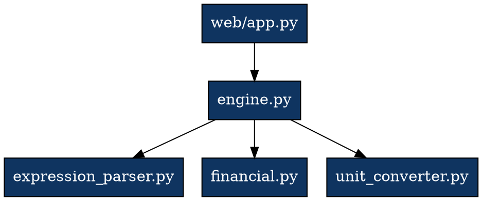

# Image Generation Skill

Create diagrams, mockups, and visual assets using text-based tools.

## Tools Available

### 1. Mermaid (Diagrams as Code)
```bash
# Install if needed
npm install -g @mermaid-js/mermaid-cli

# Generate diagram
mmdc -i diagram.mmd -o diagram.png -t dark -b transparent
```

### 2. Graphviz (Graph Visualization)
```bash
# Install if needed
apt install graphviz  # (if sudo available)

# Generate diagram
dot -Tpng diagram.dot -o diagram.png
```

### 3. Python (matplotlib, pillow)
```bash
# Generate charts
python3 -c "
import matplotlib.pyplot as plt
plt.figure(figsize=(10, 6))
plt.plot([1, 2, 3, 4], [1, 4, 9, 16])
plt.savefig('chart.png')
"
```

### 4. ASCII Art (Text-based)
```bash
# Generate ASCII diagrams
echo "
┌─────────────┐     ┌─────────────┐     ┌─────────────┐
│   Input     │────▶│  Process    │────▶│   Output    │
└─────────────┘     └─────────────┘     └─────────────┘
" > diagram.txt
```

## Architecture Diagrams

### System Architecture (Mermaid)
```markdown
# architecture.mmd
graph TD
    A[Browser] -->|HTTP| B[Flask Server]
    B -->|API| C[Core Engine]
    C --> D[Expression Parser]
    C --> E[Financial Module]
    C --> F[Unit Converter]
    C --> G[Graph Engine]
    B --> H[SQLite Database]
    B --> I[File System]
```

### Data Flow (Mermaid)
```markdown
# dataflow.mmd
sequenceDiagram
    participant U as User
    participant B as Browser
    participant S as Server
    participant C as Core Engine

    U->>B: Enter expression
    B->>S: POST /api/calculate
    S->>C: engine.calculate(expr)
    C->>C: Parse expression
    C->>C: Evaluate
    C-->>S: Return result
    S-->>B: JSON response
    B-->>U: Display result
```

### Module Dependency (Graphviz)


## UI Mockups

### ASCII Mockup
```
┌─────────────────────────────────────────────┐
│  Multi-Mode Calculator              ☰ Menu  │
├─────────────────────────────────────────────┤
│                                             │
│  ┌─────────────────────────────────────┐   │
│  │  0                                  │   │
│  └─────────────────────────────────────┘   │
│                                             │
│  ┌───────┐ ┌───────┐ ┌───────┐ ┌───────┐  │
│  │   7   │ │   8   │ │   9   │ │   ÷   │  │
│  └───────┘ └───────┘ └───────┘ └───────┘  │
│  ┌───────┐ ┌───────┐ ┌───────┐ ┌───────┐  │
│  │   4   │ │   5   │ │   6   │ │   ×   │  │
│  └───────┘ └───────┘ └───────┘ └───────┘  │
│  ┌───────┐ ┌───────┐ ┌───────┐ ┌───────┐  │
│  │   1   │ │   2   │ │   3   │ │   -   │  │
│  └───────┘ └───────┘ └───────┘ └───────┘  │
│  ┌───────┐ ┌───────┐ ┌───────┐ ┌───────┐  │
│  │   0   │ │   .   │ │  ±    │ │   +   │  │
│  └───────┘ └───────┘ └───────┘ └───────┘  │
│  ┌───────────────────────┐ ┌─────────────┐  │
│  │           AC          │ │     =       │  │
│  └───────────────────────┘ └─────────────┘  │
│                                             │
│  [Standard] [Scientific] [Programmer]       │
└─────────────────────────────────────────────┘
```

## Charts

### Performance Chart (matplotlib)
```python
import matplotlib.pyplot as plt
import json

# Load benchmark data
data = []
with open('/tmp/perf_benchmark.log') as f:
    for line in f:
        # Parse benchmark entries
        pass

# Create chart
plt.figure(figsize=(10, 6))
plt.plot(dates, durations, marker='o')
plt.title('Calculator Performance Over Time')
plt.xlabel('Date')
plt.ylabel('Time (seconds)')
plt.grid(True)
plt.savefig('performance_chart.png', dpi=150, bbox_inches='tight')
```

### Test Coverage Chart
```python
import matplotlib.pyplot as plt

modules = ['engine', 'financial', 'units', 'statistics', 'graph']
coverage = [95, 88, 92, 85, 78]

plt.figure(figsize=(10, 6))
bars = plt.bar(modules, coverage, color=['#2ed573', '#2ed573', '#2ed573', '#e94560', '#e94560'])
plt.title('Test Coverage by Module')
plt.xlabel('Module')
plt.ylabel('Coverage (%)')
plt.axhline(y=90, color='gray', linestyle='--', label='90% target')
plt.legend()
plt.savefig('coverage_chart.png', dpi=150, bbox_inches='tight')
```

## Export Formats

| Format | Use For | Tool |
|--------|---------|------|
| PNG | Screenshots, documentation | mermaid, graphviz, matplotlib |
| SVG | Web, scalable graphics | mermaid, graphviz |
| PDF | Print, reports | graphviz, matplotlib |
| ASCII | Terminal, markdown | manual |
| JSON | Data visualization | D3.js (web) |

## Rules

- Use text-based tools (Mermaid, Graphviz) for maintainable diagrams
- Keep diagrams simple and focused
- Use consistent color scheme (dark theme colors)
- Export to PNG for documentation
- Version control diagram source files
- Update diagrams when architecture changes
